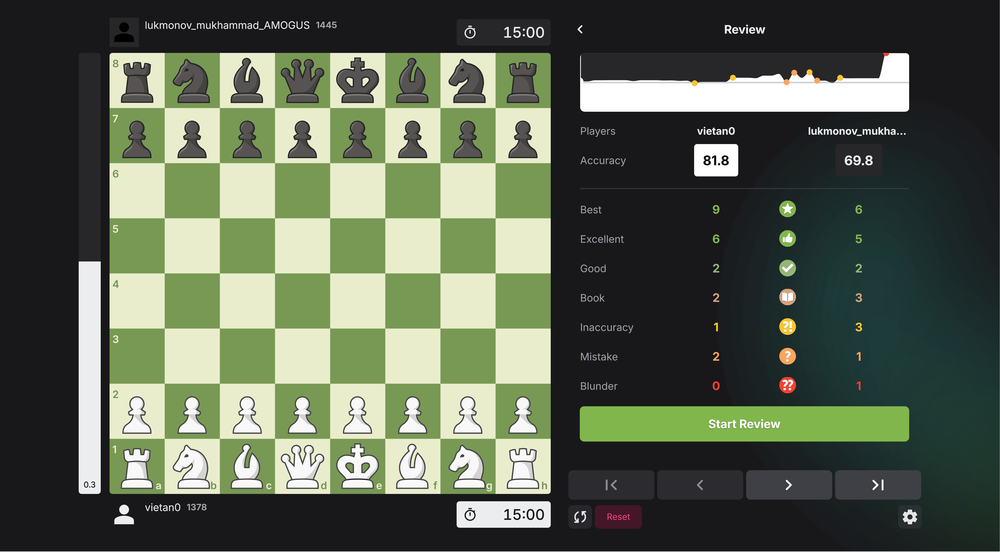
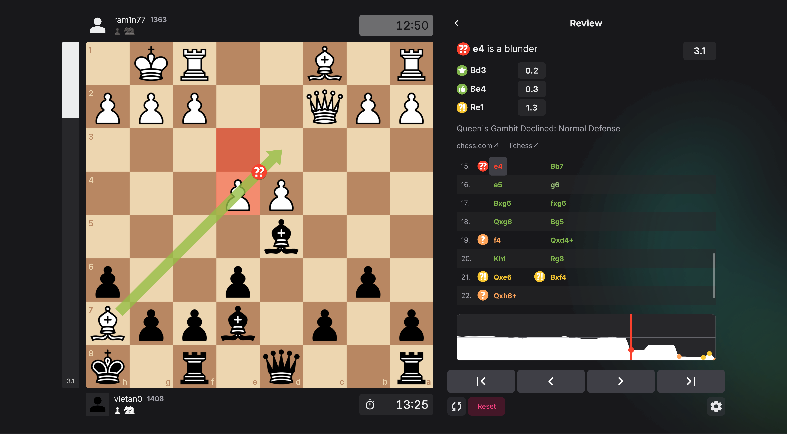

# Game Review

Review your chess games from chess.com, lichess, or PGN at [chessrev.netlify.app](https://chessrev.netlify.app/). For free!

Inspired by [wintrcat](https://www.youtube.com/watch?v=N6dIEzA--7Y).

## Screenshots

## Built with

- [Chess.js](https://github.com/jhlywa/chess.js) - Chess Library
- [React](https://reactjs.org/)
- [Tanstack Query](https://tanstack.com/query/latest) - Async State Management
- [Zustand](https://zustand-demo.pmnd.rs/) - Global State Management
- [HeroUI](https://www.heroui.com/) - UI Library
- [Motion](https://motion.dev/) - Animation
- [Visx](https://airbnb.io/visx/) - Data Visualization
